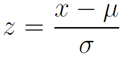
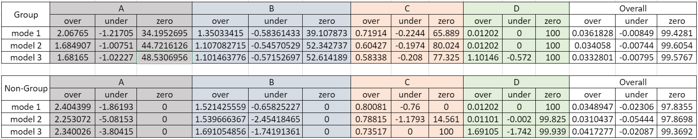
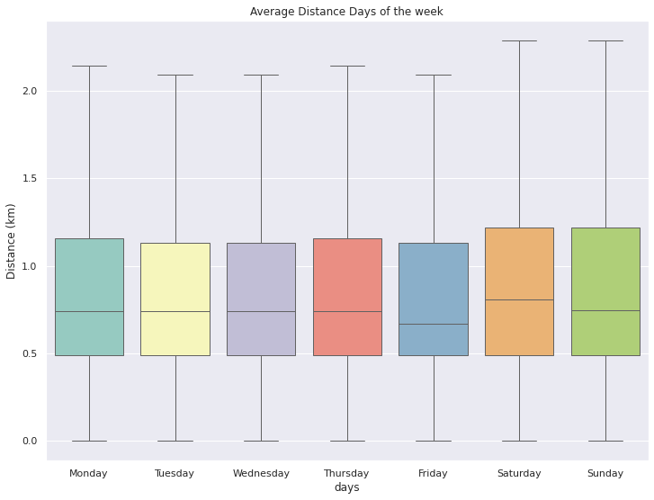
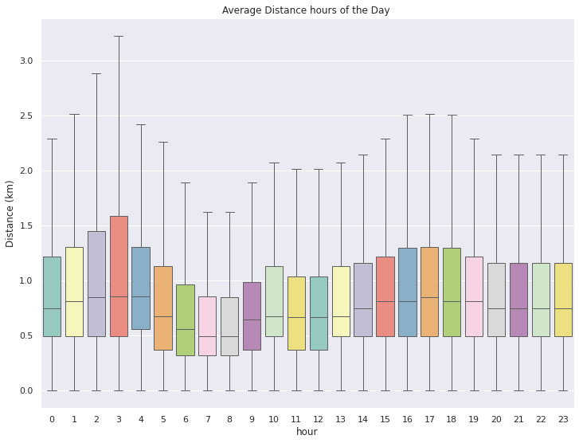

# Overview
Traffic jams in the city, as a result, many people in the city are choosing public transportation instead of their private cars. Therefore, scooters are used in response to their origin(first mile) and destination(last mile). This project aims to bring scooter user data to benefit the business.

## Problem formation
- predict the next 24-hour of scooter pick-ups.
- predict trip destinations

## Predict the next 24-hour of scooter pick-ups.
- preprocess by z-score normalization

    

- Divide the data into four groups using a

## Evaluate model

    

## Predict trip destinations

## Evaluate model

    

    