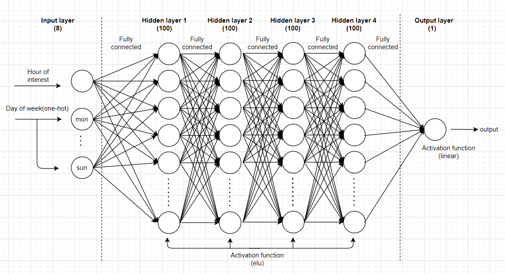
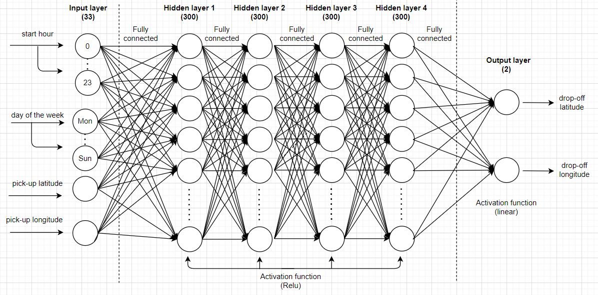

# Overview
Traffic jams in the city, as a result, many people in the city are choosing public transportation instead of their private cars. Therefore, scooters are used in response to their origin(first mile) and destination(last mile). This project aims to bring scooter user data to benefit the business.

## Problem formation
- predict the next 24-hour of scooter pick-ups.
- predict trip destinations

## Predict the next 24-hour of scooter pick-ups.
- preprocess with [z-score normalization](https://en.wikipedia.org/wiki/Standard_score)
- divide the data into 4 groups using [jenks natural breaks](https://en.wikipedia.org/wiki/Jenks_natural_breaks_optimization)

## Model Structure
- model 1
    

- model 2
    

- model 3
    

## Evaluate model
evaluate predictive models with [time-based sliding window](https://www.google.com/search?q=time-based+sliding+window)

- Overestimate = ( (actual of non-zero pick-up) - predict ) >= 0  
- Underestimate = ( (actual of non-zero pick-up) - predict ) <= 0 
- Zero accuracy = ( (predict zero pick-up) / (actual of zero pick-up) )*100

   
   
## Predict trip destinations
- preprocess by [min-max normalization](https://towardsdatascience.com/everything-you-need-to-know-about-min-max-normalization-in-python-b79592732b79)

## Model Structure
   

## Evaluate model
evaluate predictive models with [10-fold cross-validation](https://en.wikipedia.org/wiki/Cross-validation_(statistics))

- Average Distance Days of the week

- Average Distance hours of the Day

